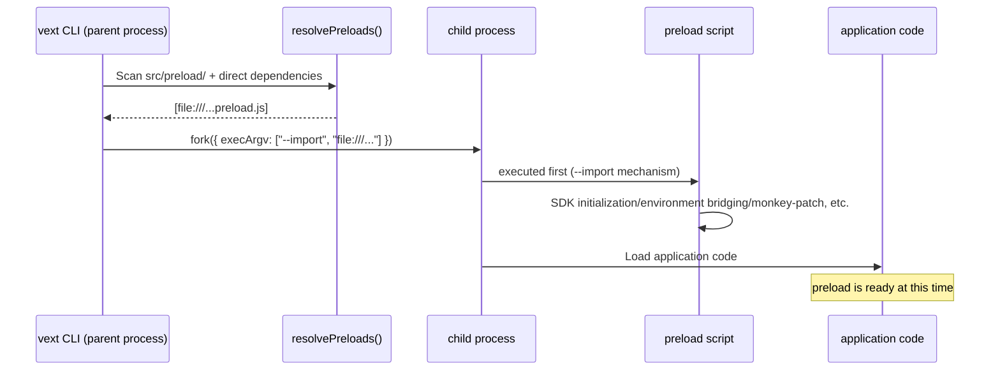

# Preload

VextJS provides the **Preload** mechanism, allowing the following two types of sources to execute scripts before the Node.js module is loaded:

1. **Dependency package declaration**: npm package declares `vext.preload` in `package.json`
2. **Project-level directory**: canonical `src/preload/` in the application project

`vext start` / `vext dev` will automatically discover these declarations and inject them into the child process via the `--import` parameter.

## Why do we need to preload?

Some tools, such as the OpenTelemetry SDK, must be initialized before the application code is loaded in order to correctly patch Node.js built-in modules (http, net, dns) and third-party libraries (MongoDB, pg, Redis, etc.).

Node.js's `--import` parameter is designed for exactly this: it ensures that the specified script is run before **any** user code is executed.

Manually adding `--import` requires modifying the startup script, which increases the configuration burden. VextJS’s preload mechanism automates this step:

- The plug-in package only needs to declare `vext.preload` in `package.json`
- The application project only needs to create `src/preload/`

The CLI will automatically complete the injection.

> Application projects do not need to package a local npm package for preload. Create `src/preload/` when the first preload source is needed; the scaffold intentionally does not create an empty directory.

## Working principle

```text
vext start / vext dev
  ↓
Scan canonical src/preload/ (or the warned legacy root preload/ fallback)
  ↓
Read dependencies + devDependencies of project package.json
  ↓
Traverse the package.json of installed dependencies and look for the "vext.preload" field
  ↓
The selected project-level preload directory and package-level preloads are merged, deduplicated and converted into file:/// URLs
  ↓
Inject into the child process execArgv with the --import <url> parameter
  ↓
When the child process starts, the preload script is executed first (earlier than all application code)
```

### Timing diagram



## Statement preload

### Method A: Project-level `src/preload/` directory

Create inside the application source directory:

```text
src/preload/
├── 01-bootstrap-port.ts
├── 02-bootstrap-verbose.mjs
└── 03-polyfill.js
```

First term rules:

| Rules                          | Description                                                                                     |
| ------------------------------ | ----------------------------------------------------------------------------------------------- |
| Directory location             | Fixed to canonical `src/preload/`                                                               |
| Scan scope                     | **Non-recursive**, only scan first-level files in the current directory                         |
| File order                     | Inject in ascending order of file names                                                         |
| Project level vs package level | **Project level preload is executed first**, and package level `vext.preload` is executed later |
| Deduplication                  | Deduplication by absolute path                                                                  |

#### Legacy root directory migration

Project-root `preload/` is supported only as a temporary migration fallback. If it contains a supported preload source, Vext emits a warning that names `src/preload/` as the target. Do not keep supported preload files in both directories: Vext fails fast instead of merging them, because a preload can initialize global instrumentation and must not run twice.

#### Supported file types

| Type   | Processing                                                       | Recommendation |
| ------ | ---------------------------------------------------------------- | :------------: |
| `.mjs` | Direct injection                                                 | ✅ Recommended |
| `.js`  | Inject directly under ESM project                                |  ✅ Available  |
| `.ts`  | Compile to `.vext/preload/*.mjs` before starting and then inject |  ✅ Available  |
| `.mts` | Compile to `.vext/preload/*.mjs` before starting and then inject | ✅ Recommended |

> It is recommended to use `.mjs` / `.mts` first, which has the clearest semantics.

#### How TypeScript preload works

If the project-level `src/preload/` directory contains `.ts` / `.mts` files, the CLI will use `esbuild` to compile them to:

```text
.vext/preload/*.mjs
```

For example:

```text
src/preload/01-bootstrap-port.ts
→ .vext/preload/01-bootstrap-port.__compiled__.mjs
→ --import file:///.../.vext/preload/01-bootstrap-port.__compiled__.mjs
```

The purpose of this is to ensure that: without modifying the `vext build` main compilation chain:

- `vext dev`
- `vext start`
  -Cluster worker

The preload behavior of the three links is consistent.

#### Behavior under `vext dev`

Project-level preload belongs to **execution logic before startup**. Therefore, when files in `src/preload/` are added/modified/deleted:

- `vext dev` will listen to this directory
- and trigger **cold restart** uniformly

This ensures that the results are consistent with manual restarts and avoids "the preload has changed but the development server still uses the old injection results".

### Method B: Dependency package `vext.preload`

Add the `vext.preload` field in the `package.json` of the npm package:

```json
{
  "name": "my-vext-plugin",
  "vext": {
    "preload": "./dist/instrumentation.js"
  }
}
```

#### Field format

| Format | Example                          | Description                               |
| ------ | -------------------------------- | ----------------------------------------- |
| String | `"./dist/init.js"`               | Single preload script                     |
| Array  | `["./dist/a.js", "./dist/b.js"]` | Multiple scripts, injected in array order |

Paths are relative to the package root (`node_modules/<package>/`) and are automatically resolved to absolute paths by the CLI.

#### Real example

`@devcodex/opentelemetry` has this declaration built in:

```json
{
  "name": "@devcodex/opentelemetry",
  "vext": {
    "preload": "./dist/instrumentation.js"
  }
}
```

After installation, `vext start` / `vext dev` automatically injects `--import`, OpenTelemetry SDK completes initialization before the application starts, and automatic patches such as MongoDB / pg / Redis take effect.

## Applicable scenarios

| Scene                                    | Description                                                                                                  |
| ---------------------------------------- | ------------------------------------------------------------------------------------------------------------ |
| **OpenTelemetry SDK**                    | Must be initialized before module loading to monkey-patch HTTP/DB client                                     |
| **APM Tools**                            | Datadog, New Relic and other APM agents are the same                                                         |
| **Global polyfill**                      | A global patch that needs to be injected before all code is executed                                         |
| **Process-level configuration bridging** | For example, setting environment variables for the bootstrap provider to read during the configuration phase |

## The boundary between preload and bootstrap config provider`preload` and `src/config/bootstrap.ts` both occur before the application is fully started, but have different responsibilities:

| capabilities                                                      | preload                                                                 | bootstrap config provider                    |
| ----------------------------------------------------------------- | ----------------------------------------------------------------------- | -------------------------------------------- |
| Execution timing                                                  | Before Node.js module is loaded (`--import`)                            | Before configuring merge / validate / freeze |
| Main responsibilities                                             | SDK initialization, environment bridging, monkey patch, global polyfill | Return structured configuration patch        |
| Whether to participate in the configuration priority chain        | ❌                                                                      | ✅                                           |
| Is it suitable as the main path for remote database configuration | ❌                                                                      | ✅                                           |

Recommended practices:

- **APM/OpenTelemetry/monkey patch** → use `preload`
- **Bridge environment variables to bootstrap provider before starting** → You can also use `preload`
- **Remote configuration center / database configuration main chain during startup** → Use `bootstrap config provider`
- The two can cooperate: preload first prepares the SDK, token cache or environment variables, and the provider then reads these statuses and outputs the patch.

## Three startup modes

| mode                                     | preload takes effect? | Description                                        |
| ---------------------------------------- | :-------------------: | -------------------------------------------------- |
| `vext start` / `vext dev`                |          ✅           | CLI automatically discovers and injects `--import` |
| `node --import <path> dist/server.js`    |          ✅           | Manually add `--import`, the effect is the same    |
| `node dist/server.js` (without --import) |          ❌           | preload script will not execute                    |

> It is recommended to use `vext start` / `vext dev` to enjoy the convenience of automatic injection.

## Cluster mode

In Cluster mode, the preload script also takes effect. The CLI passes the `--import` argument to all Worker processes via `cluster.setupPrimary({ execArgv })`:

```bash
VEXT_CLUSTER=1 vext start # Each Worker automatically loads the preload script
```

## Notes

### Safe Behavior

- **The project-level directory is a controlled single directory**: `src/preload/` is canonical and is scanned non-recursively. Project-root `preload/` is a warned compatibility fallback, not a second source directory.
- **Only scan direct dependencies**: CLI only reads the `dependencies` + `devDependencies` of the project `package.json`, and does not recursively scan sub-dependencies
- **Skip when the file does not exist**: When the file pointed to by `vext.preload` does not exist, the CLI will output a warning and skip it, without blocking startup.
- **Downgrade when parsing fails**: The dependent package `package.json` is silently skipped when parsing fails.
- **fail-fast when project-level TS preload compilation fails**: avoid bringing obviously unexecutable TS preload into the running phase
- **No impact when there is no preload declaration**: When there is no project-level directory or package-level preload declaration, the CLI behavior is exactly the same as before.

### Coexists with manual `--import`

CLI-injected `--import` does not conflict with `--import` manually added by the user. If the same script is injected twice, there is usually global registration protection inside the SDK and it will not be initialized repeatedly.

### Suggestions for developing preload scripts

- Scripts should be executed quickly to avoid blocking application startup
- If it is `.js` / `.ts`, please make sure the project adopts ESM semantics (`"type": "module"`)
- Errors should be handled by yourself; in the case of TS preload, syntax compilation errors will directly interrupt the startup

### Deployment boundaries

If you are using **project-level `src/preload/`**:

- `vext build` will compile `src/preload/` to `dist/preload/`
- `.ts` / `.mts` / `.js` / `.mjs` will all be uniformly output into `.mjs` files that can be directly `--import`
- Therefore, when deploying in production, you usually only need to carry:
  - Project root `package.json`
  - `dist/` (which already contains `dist/preload/`, if used)

`vext start` resolves populated `src/preload/` first, uses a populated legacy root `preload/` only as a warned fallback, and otherwise falls back to `dist/preload/` for a built deployment.

## Write custom preload

### Write project-level preload

```ts
// src/preload/01-bootstrap-port.ts
process.env.APP_BOOTSTRAP_PORT = "3011";
```

```js
// src/preload/02-sdk.mjs
try {
  const { init } = await import("../src/sdk.js");
  await init();
} catch (err) {
  console.warn("[app preload] init failed:", err.message);
}
```

### Write package-level preload

If you are developing a vext plugin package that requires preload:

```typescript
// src/instrumentation.ts — preload entry
try {
  console.log("[my-plugin] preload script executed");

  const { init } = await import("./sdk.js");
  await init();
} catch (err) {
  console.warn("[my-plugin] preload failed:", (err as Error).message);
}

export {};
```

Declare in `package.json`:

```json
{
  "name": "my-vext-plugin",
  "vext": {
    "preload": "./dist/instrumentation.js"
  }
}
```

After building, any project using `vext start` / `vext dev` will have the preload script automatically executed after installing this package.

## Next step

- See [OpenTelemetry Observability](/examples/opentelemetry) for typical applications of preload
- Understand the full capabilities of the [plugins](/guide/plugins) system
- Explore preload behavior in [Cluster multi-process](/guide/cluster) mode
