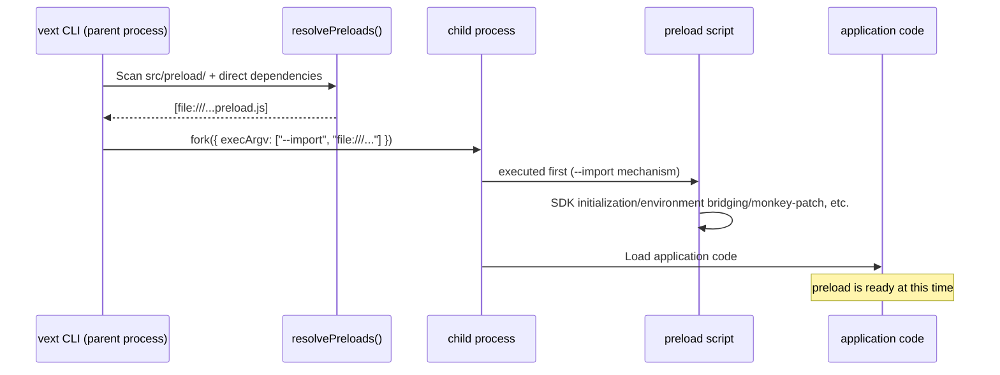

# Preload

VextJS provides a **Preload** mechanism that runs scripts from two sources before the application entry module:

1. **Dependency package declaration**: npm package declares `vext.preload` in `package.json`
2. **Project-level directory**: canonical `src/preload/` in the application project

`vext start` / `vext dev` discover these declarations and inject them into child processes through `--import`.

Package preloads resolve from the service's declared direct dependencies, including hoisted installations and pnpm links. Metadata remains discoverable when a package keeps `package.json` private or only exports subpaths. Script paths are relative to the resolved package root and deduplicated by their real paths; each service does not need its own copy under `node_modules/<package>`.

## Complete project example and verification

Start with the API project from [Quick Start](/guide/quick-start) and create these three files. The example only bridges an application environment variable and requires no extra SDK.

```typescript
// src/preload/01-bootstrap-port.ts
process.env.APP_BOOTSTRAP_PORT = "3011";
```

```typescript
// src/config/default.ts
export default {
  port: Number(process.env.APP_BOOTSTRAP_PORT) || 3000,
  adapter: "native",
  frontend: { enabled: false },
};
```

```typescript
// src/routes/preload-info.ts
import { defineRoutes } from "vextjs";

export default defineRoutes((app) => {
  app.get("/", {}, async (_req, res) => {
    res.json({
      port: app.config.port,
      preloadValue: process.env.APP_BOOTSTRAP_PORT,
    });
  });
});
```

1. In a terminal without `VEXT_PORT`, `VEXT_CONFIG`, or similar overrides, run `npm run dev`. Request `http://127.0.0.1:3011/preload-info`; expect 200, `data.port: 3011`, and `preloadValue: "3011"`.
2. Change 3011 in the preload to 3012, wait for a cold restart, and request port 3012. Both values should change. Restore 3011 before continuing.
3. Stop dev, run `npm run build -- --typecheck`, then `npm start`. It should still use 3011. Editing source alone after a build does not alter the selected compiled preload; rebuild. Stop the service after verification.

The environment variable does not automatically configure Vext's port: `default.ts` explicitly reads `APP_BOOTSTRAP_PORT`. Build may use the 3000 fallback, while start runs preload before loading configuration. For a remote configuration patch with defined override order, use a [bootstrap provider](/guide/configuration#bootstrap-config-provider).

## Why do we need to preload?

Some tools, such as the OpenTelemetry SDK, must be initialized before the application code is loaded in order to correctly patch Node.js built-in modules (http, net, dns) and third-party libraries (MongoDB, pg, Redis, etc.).

Node.js runs modules supplied through `--import` before the application entry. Multiple `--import` flags follow argument order; entries in `NODE_OPTIONS` precede command-line entries, and `--require` precedes `--import`. A Vext-injected script therefore is not necessarily earlier than every other preload. See the [Node.js 20 CLI reference](https://nodejs.org/docs/latest-v20.x/api/cli.html#--importmodule).

Manually adding `--import` requires modifying the startup script, which increases the configuration burden. VextJS’s preload mechanism automates this step:

- The plug-in package only needs to declare `vext.preload` in `package.json`
- The application project only needs to create `src/preload/`

The CLI will automatically complete the injection.

> Application projects do not need to package a local npm package for preload. Create `src/preload/` when the first preload source is needed; the scaffold intentionally does not create an empty directory.

## Working principle

```text
vext start / vext dev
  ↓
Scan canonical src/preload/ (or the warned legacy root preload/ fallback)
  ↓
Read dependencies + devDependencies of project package.json
  ↓
Traverse the package.json of installed dependencies and look for the "vext.preload" field
  ↓
The selected project-level preload directory and package-level preloads are merged, deduplicated and converted into file:/// URLs
  ↓
Inject into the child process execArgv with the --import <url> parameter
  ↓
When the child process starts, the preload script is executed first (earlier than all application code)
```

### Timing diagram


```mermaid
sequenceDiagram
    participant CLI as vext CLI (parent process)
    participant PR as resolvePreloads()
    participant Child as child process
    participant Script as preload script
    participant App as application code

    CLI->>PR: Scan src/preload/ + direct dependencies
    PR-->>CLI: [file:///...preload.js]
    CLI->>Child: fork({ execArgv: ["--import", "file:///..."] })
    Child->>Script: executed first (--import mechanism)
    Script->>Script: SDK initialization/environment bridging/monkey-patch, etc.
    Child->>App: Load application code
    Note over App: preload is ready at this time
```

## Statement preload

### Method A: Project-level `src/preload/` directory

Create inside the application source directory:

```text
src/preload/
├── 01-bootstrap-port.ts
├── 02-bootstrap-verbose.mjs
└── 03-polyfill.js
```

First term rules:

| Rules                          | Description                                                                                      |
| ------------------------------ | ------------------------------------------------------------------------------------------------ |
| Directory location             | Fixed to canonical `src/preload/`                                                                |
| Scan scope                     | **Non-recursive**, only scan first-level files in the current directory                          |
| File order                     | Sort by filename using `localeCompare`; use numeric prefixes such as 01/02 for intentional order |
| Project level vs package level | **Project level preload is executed first**, and package level `vext.preload` is executed later  |
| Deduplication                  | Deduplication by absolute path                                                                   |

#### Legacy root directory migration

Project-root `preload/` is supported only as a temporary migration fallback. If it contains a supported preload source, Vext emits a warning that names `src/preload/` as the target. Do not keep supported preload files in both directories: Vext fails fast instead of merging them, because a preload can initialize global instrumentation and must not run twice.

#### Supported file types

Subdirectories, non-regular files, and unsupported extensions are skipped with warnings. This directory does not share the plugins directory's leading-underscore exclusion rule; do not rely on `_` to disable a preload.

| Type   | Processing                                                       | Recommendation |
| ------ | ---------------------------------------------------------------- | :------------: |
| `.mjs` | Direct injection                                                 | ✅ Recommended |
| `.js`  | Inject directly under ESM project                                |  ✅ Available  |
| `.ts`  | Compile to `.vext/preload/*.mjs` before starting and then inject |  ✅ Available  |
| `.mts` | Compile to `.vext/preload/*.mjs` before starting and then inject | ✅ Recommended |

> It is recommended to use `.mjs` / `.mts` first, which has the clearest semantics.

#### How TypeScript preload works

In dev and plain JavaScript source mode, the CLI uses `esbuild` to compile `.ts` / `.mts` files in `src/preload/` to:

```text
.vext/preload/*.mjs
```

For example:

```text
src/preload/01-bootstrap-port.ts
→ .vext/preload/01-bootstrap-port.__compiled__.mjs
→ --import file:///.../.vext/preload/01-bootstrap-port.__compiled__.mjs
```

Compiled production mode loads `<outdir>/preload/*.mjs` generated by `vext build`, without recompiling source preloads. Single-process and cluster workers use the same selection. Rebuild to apply source changes.

All TS / MTS preloads selected in one resolution must compile successfully before their cache is committed together. A compilation failure stops that startup or restart and preserves the entire previous cache; retry after fixing the source. A `.ts` and `.mts` file with the same stem target the same cache path, so use different names. The project writer and artifact ownership manifest protect the cache: external edits cause a conflict, source deletion removes only recorded and unmodified obsolete cache files, and unknown files remain untouched. Plain JS and valid compiled production reads do not create a compilation cache.

A missing or empty source directory retains the compatibility fallback to the default `dist/preload/`. Read failures, a regular file occupying the source directory, or a directory linked outside the service root cause an error instead of being treated as missing and loading old preloads.

#### Behavior under `vext dev`

Project-level preload belongs to **execution logic before startup**. Therefore, when files in `src/preload/` are added/modified/deleted:

- `vext dev` will listen to this directory
- and trigger **cold restart** uniformly

This ensures that the results are consistent with manual restarts and avoids "the preload has changed but the development server still uses the old injection results".

### Method B: Dependency package `vext.preload`

Add the `vext.preload` field in the `package.json` of the npm package:

```json
{
  "name": "my-vext-plugin",
  "vext": {
    "preload": "./dist/instrumentation.js"
  }
}
```

#### Field format

| Format | Example                          | Description                               |
| ------ | -------------------------------- | ----------------------------------------- |
| String | `"./dist/init.js"`               | Single preload script                     |
| Array  | `["./dist/a.js", "./dist/b.js"]` | Multiple scripts, injected in array order |

Paths are relative to the package root (`node_modules/<package>/`) and are automatically resolved to absolute paths by the CLI.

#### Observability SDK integration example

For an observability SDK such as `@devcodex/opentelemetry`, check that the installed version's package.json contains a declaration like this and that the target script is published with the package:

```json
{
  "name": "@devcodex/opentelemetry",
  "vext": {
    "preload": "./dist/instrumentation.js"
  }
}
```

With a valid declaration and file, `vext start` / `vext dev` inject the script. Verify supported instrumentation modules and versions, SDK configuration, and actual reporting against that SDK; injection alone does not prove all database tracing works. See [OpenTelemetry](/examples/opentelemetry).

## Applicable scenarios

| Scenario                                 | Description                                                                                                  |
| ---------------------------------------- | ------------------------------------------------------------------------------------------------------------ |
| **OpenTelemetry SDK**                    | Must be initialized before module loading to monkey-patch HTTP/DB client                                     |
| **APM Tools**                            | Datadog, New Relic and other APM agents are the same                                                         |
| **Global polyfill**                      | A global patch that needs to be injected before all code is executed                                         |
| **Process-level configuration bridging** | For example, setting environment variables for the bootstrap provider to read during the configuration phase |

## The boundary between preload and bootstrap config provider

`preload` and `src/config/bootstrap.ts` both occur before the application is fully started, but have different responsibilities:

| capabilities                                                      | preload                                                                 | bootstrap config provider                    |
| ----------------------------------------------------------------- | ----------------------------------------------------------------------- | -------------------------------------------- |
| Execution timing                                                  | Before Node.js module is loaded (`--import`)                            | Before configuring merge / validate / freeze |
| Main responsibilities                                             | SDK initialization, environment bridging, monkey patch, global polyfill | Return structured configuration patch        |
| Whether to participate in the configuration priority chain        | ❌                                                                      | ✅                                           |
| Is it suitable as the main path for remote database configuration | ❌                                                                      | ✅                                           |

Recommended practices:

- **APM/OpenTelemetry/monkey patch** → use `preload`
- **Bridge environment variables to bootstrap provider before starting** → You can also use `preload`
- **Remote configuration center / database configuration main chain during startup** → Use `bootstrap config provider`
- The two can cooperate: preload first prepares the SDK, token cache or environment variables, and the provider then reads these statuses and outputs the patch.

## Three startup modes

| mode                                       | preload takes effect? | Description                                            |
| ------------------------------------------ | :-------------------: | ------------------------------------------------------ |
| `vext start` / `vext dev`                  |          ✅           | CLI automatically discovers and injects `--import`     |
| `node --import <path> ./entry.mjs`         |          ✅           | A custom application entry manually loads the script   |
| `node ./entry.mjs` (no preload configured) |          ❌           | Vext preload conventions are not scanned automatically |

Use `vext start` / `vext dev` for automatic injection. Vext build output does not promise a directly executable `dist/server.js`; production applications should use `vext start` to select and verify build output. `vext build` compiles preloads but does not execute them as startup scripts, so source configuration should not require startup-only preload state to build successfully.

## Cluster mode

In Cluster mode, the preload script also takes effect. The CLI passes the `--import` argument to all Worker processes via `cluster.setupPrimary({ execArgv })`:

```bash
VEXT_CLUSTER=1 vext start # Each Worker automatically loads the preload script
```

In PowerShell, set `$env:VEXT_CLUSTER="1"` before `vext start` and remove it after verification. Initialization runs per process; a preload is not a place for a data migration that must run only once globally.

## Notes

### Safe Behavior

- **The project-level directory is a controlled single directory**: `src/preload/` is canonical and is scanned non-recursively. Project-root `preload/` is a warned compatibility fallback, not a second source directory.
- **Only scan direct dependencies**: CLI only reads the `dependencies` + `devDependencies` of the project `package.json`, and does not recursively scan sub-dependencies
- **Skip when the file does not exist**: When the file pointed to by `vext.preload` does not exist, the CLI will output a warning and skip it, without blocking startup.
- **Warn and skip on parsing failure**: Package resolution failures produce warnings. A field other than string/string[] or an array with nonstring entries also warns while retaining valid entries.
- **fail-fast when project-level TS preload compilation fails**: avoid bringing obviously unexecutable TS preload into the running phase
- **No impact when there is no preload declaration**: When there is no project-level directory or package-level preload declaration, the CLI behavior is exactly the same as before.

### Coexists with manual `--import`

The CLI deduplicates only its own resolved list; it does not clean up `NODE_OPTIONS` or other user startup arguments. Do not depend on an SDK's presumed idempotency protection. Choose one injection entry and inspect actual process logs, ordering, and SDK initialization. `NODE_OPTIONS` may affect the parent process too.

### Suggestions for developing preload scripts

- Scripts should be executed quickly to avoid blocking application startup
- If it is `.js` / `.ts`, please make sure the project adopts ESM semantics (`"type": "module"`)
- For optional behavior, explicitly catch errors and explain the fallback. A required capability should throw so startup cannot continue without its prerequisite. TS syntax compilation failures interrupt that startup.

### Deployment boundaries

If you are using **project-level `src/preload/`**:

- `vext build` compiles `src/preload/` into `preload/` under the selected output directory, `dist/preload/` by default
- `.ts` / `.mts` / `.js` / `.mjs` will all be uniformly output into `.mjs` files that can be directly `--import`
- Therefore, when deploying in production, you usually only need to carry:
  - Project root `package.json`
  - `dist/` (which already contains `dist/preload/`, if used)

Compiled `vext start` loads only the selected output's `preload/`. For custom output, carry `.vext/build-location.json` and the output's `.vext-build.json`, or select it with `vext start --outdir <directory>`. Runtime dependencies must also be installed. Valid compiled deployments do not require sources. Dev and plain JavaScript source mode prefer `src/preload/`, with legacy root `preload/` as a warned compatibility fallback.

## Write custom preload

Project SDK initialization can live in another preload that imports a real module. From `src/preload/02-sdk.mts`, an import of `src/sdk.ts` should use `../sdk.js` under TypeScript resolution, not `../src/sdk.js`. For a directly executed `.mjs`, relative paths must resolve from the actual runtime location.

### Write package-level preload

If you are developing a vext plugin package that requires preload:

```typescript
// src/instrumentation.ts — preload entry
try {
  console.log("[my-plugin] preload script executed");

  const { init } = await import("./sdk.js");
  await init();
} catch (err) {
  console.warn("[my-plugin] preload failed:", (err as Error).message);
}

export {};
```

Declare in `package.json`:

```json
{
  "name": "my-vext-plugin",
  "vext": {
    "preload": "./dist/instrumentation.js"
  }
}
```

The package author supplies `sdk.js` and the build process. After building, verify the declared target is included in the published package. A consuming project must declare and install the package as a direct dependency for `vext start` / `vext dev` to discover it; a transitive dependency alone is insufficient. An SDK required in production should not exist only in devDependencies omitted from deployment.

## Troubleshooting and recheck

| Symptom                              | Cause and action                                                                                      | Recheck                                          |
| ------------------------------------ | ----------------------------------------------------------------------------------------------------- | ------------------------------------------------ |
| Script did not execute               | Check startup command, direct dependency declaration/installation, extension, and target path         | Read the actual value using `preload-info` above |
| Source edit has no production effect | Start reads the selected built preload                                                                | Rebuild, restart, and request again              |
| Two source directories conflict      | Both `src/preload` and legacy `preload` contain supported files                                       | Consolidate in the canonical directory and start |
| TS compile or cache conflict         | Inspect the named file and fix syntax or external edits; old cache does not prove the new version ran | Restart and check the new value                  |
| SDK initializes twice                | Inspect manual arguments, `NODE_OPTIONS`, and multiple processes                                      | Check initialization count for each PID          |
| Port did not change                  | Check local/provider/CLI overrides and whether configuration reads the variable                       | Clear overrides and repeat the complete example  |

## Next step

- See [OpenTelemetry Observability](/examples/opentelemetry) for typical applications of preload
- Understand the full capabilities of the [plugins](/guide/plugins) system
- Explore preload behavior in [Cluster multi-process](/guide/cluster) mode
