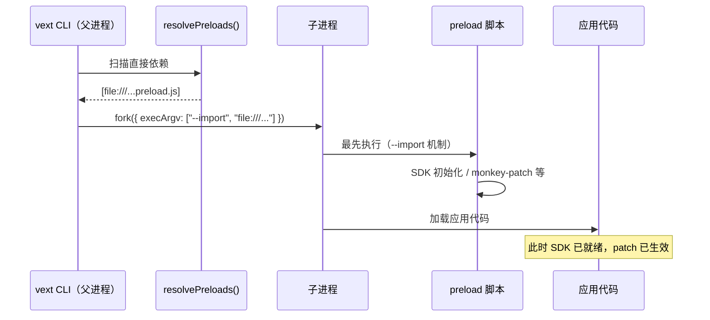

# 预加载（Preload）

VextJS 提供了 **预加载（Preload）** 机制，允许 npm 包声明需要在 Node.js 模块加载之前执行的脚本。`vext start` / `vext dev` 会自动发现这些声明，并通过 `--import` 参数注入到子进程中。

## 为什么需要预加载？

某些工具（如 OpenTelemetry SDK）必须在应用代码加载**之前**完成初始化，才能正确 patch Node.js 内置模块（http、net、dns）和第三方库（MongoDB、pg、Redis 等）。

Node.js 的 `--import` 参数正是为此设计：它确保指定脚本在**任何**用户代码执行前运行。

手动添加 `--import` 需要修改启动脚本，增加了配置负担。VextJS 的 preload 机制将这一步**自动化**——npm 包只需在 `package.json` 中声明，CLI 自动完成注入。

## 工作原理

```
vext start / vext dev
  ↓
读取项目 package.json 的 dependencies + devDependencies
  ↓
遍历已安装依赖的 package.json，查找 "vext.preload" 字段
  ↓
收集所有 preload 脚本路径，转换为 file:/// URL
  ↓
以 --import <url> 参数注入到子进程 execArgv
  ↓
子进程启动时，preload 脚本最先执行（早于所有应用代码）
```

### 时序图



## 声明 preload

在 npm 包的 `package.json` 中添加 `vext.preload` 字段：

```json
{
  "name": "my-vext-plugin",
  "vext": {
    "preload": "./dist/instrumentation.js"
  }
}
```

### 字段格式

| 格式 | 示例 | 说明 |
|------|------|------|
| 字符串 | `"./dist/init.js"` | 单个预加载脚本 |
| 数组 | `["./dist/a.js", "./dist/b.js"]` | 多个脚本，按数组顺序注入 |

路径相对于包根目录（`node_modules/<package>/`），由 CLI 自动解析为绝对路径。

### 真实示例

`vextjs-opentelemetry` 已内置此声明：

```json
{
  "name": "vextjs-opentelemetry",
  "vext": {
    "preload": "./dist/instrumentation.js"
  }
}
```

安装后，`vext start` / `vext dev` 自动注入 `--import`，OpenTelemetry SDK 在应用启动前完成初始化，MongoDB / pg / Redis 等自动 patch 生效。

## 适用场景

| 场景 | 说明 |
|------|------|
| **OpenTelemetry SDK** | 必须在模块加载前初始化，才能 monkey-patch HTTP/DB 客户端 |
| **APM 工具** | Datadog、New Relic 等 APM agent 同理 |
| **全局 polyfill** | 需要在所有代码执行前注入的全局补丁 |
| **进程级配置** | 例如设置全局环境变量、注册自定义 loader |

## preload 与 bootstrap config provider 的边界

`preload` 和 `src/config/bootstrap.ts` 都发生在应用完全启动前，但职责不同：

| 能力 | preload | bootstrap config provider |
|------|---------|---------------------------|
| 执行时机 | Node.js 模块加载前（`--import`） | 配置 merge / validate / freeze 之前 |
| 主要职责 | SDK 初始化、monkey patch、全局 polyfill | 返回结构化配置补丁 |
| 是否参与配置优先级链 | ❌ | ✅ |
| 是否适合作为远程数据库配置主路径 | ❌ | ✅ |

推荐做法：

- **APM / OpenTelemetry / monkey patch** → 用 `preload`
- **远程配置中心 / 启动期数据库配置** → 用 `bootstrap config provider`
- 两者可以配合：preload 先准备 SDK 或 token cache，provider 再读取共享状态产出 patch

## 三种启动模式

| 模式 | preload 生效？ | 说明 |
|------|:-:|------|
| `vext start` / `vext dev` | ✅ | CLI 自动发现并注入 `--import` |
| `node --import <path> dist/server.js` | ✅ | 手动添加 `--import`，效果相同 |
| `node dist/server.js`（无 --import）| ❌ | preload 脚本不会执行 |

> 推荐使用 `vext start` / `vext dev`，享受自动注入的便利。

## Cluster 模式

在 Cluster 模式下，preload 脚本同样生效。CLI 通过 `cluster.setupPrimary({ execArgv })` 将 `--import` 参数传递给所有 Worker 进程：

```bash
VEXT_CLUSTER=1 vext start   # 每个 Worker 自动加载 preload 脚本
```

## 注意事项

### 安全行为

- **仅扫描直接依赖**：CLI 只读取项目 `package.json` 的 `dependencies` + `devDependencies`，不递归扫描子依赖
- **文件不存在时跳过**：`vext.preload` 指向的文件不存在时，CLI 输出 warning 并跳过，不阻断启动
- **解析失败时降级**：依赖包 `package.json` 解析失败时静默跳过
- **无 preload 包时无影响**：没有任何包声明 `vext.preload` 时，CLI 行为与之前完全一致

### 与手动 --import 共存

CLI 注入的 `--import` 与用户手动添加的 `--import` 不冲突。如果同一脚本被注入两次，SDK 内部通常有全局注册保护，不会重复初始化。

### 开发 preload 脚本的要求

- 脚本必须是 ESM 格式（`--import` 要求）
- 脚本应快速执行，避免阻塞应用启动
- 错误应自行处理（try/catch），不应抛出未捕获异常导致进程退出

## 编写自定义 preload

如果你正在开发一个需要 preload 的 vext 插件包：

```typescript
// src/instrumentation.ts — preload 入口
try {
  // 在此执行需要在模块加载前完成的初始化
  console.log("[my-plugin] preload script executed");
  
  // 例如：初始化 APM SDK
  const { init } = await import("./sdk.js");
  await init();
} catch (err) {
  // 错误不应阻断应用启动
  console.warn("[my-plugin] preload failed:", (err as Error).message);
}

export {};
```

在 `package.json` 中声明：

```json
{
  "name": "my-vext-plugin",
  "vext": {
    "preload": "./dist/instrumentation.js"
  }
}
```

构建后，任何使用 `vext start` / `vext dev` 的项目安装此包后，preload 脚本会自动执行。

## 下一步

- 查看 [OpenTelemetry 可观测性](/examples/opentelemetry) 了解 preload 的典型应用
- 了解 [插件](/guide/plugins) 系统的完整能力
- 探索 [Cluster 多进程](/guide/cluster) 模式下的 preload 行为

