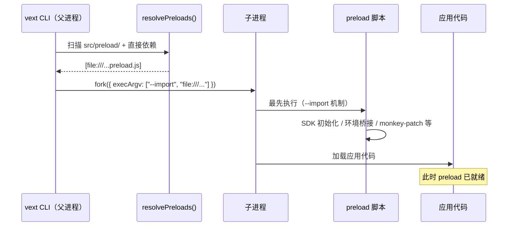

# 预加载（Preload）

VextJS 提供了 **预加载（Preload）** 机制，允许以下两类来源在应用入口模块执行之前运行脚本：

1. **依赖包声明**：npm 包在 `package.json` 中声明 `vext.preload`
2. **项目级目录**：应用项目中的规范目录 `src/preload/`

`vext start` / `vext dev` 会自动发现这些声明，并通过 `--import` 参数注入到子进程中。

包级 preload 从当前服务声明的直接依赖解析实际包根，支持依赖提升和 pnpm 链接；包未导出 `package.json` 或只导出子路径也能读取其 preload 元数据。脚本路径相对该包根解析，按真实文件路径去重，不要求每个服务各有一份 `node_modules/<包名>`。

## 完整项目级示例与验证

以[快速开始](/zh/guide/quick-start)的API项目为基础，创建下面三个文件。示例仅桥接一个应用环境变量，不要求安装额外SDK。

```typescript
// src/preload/01-bootstrap-port.ts
process.env.APP_BOOTSTRAP_PORT = "3011";
```

```typescript
// src/config/default.ts
export default {
  port: Number(process.env.APP_BOOTSTRAP_PORT) || 3000,
  adapter: "native",
  frontend: { enabled: false },
};
```

```typescript
// src/routes/preload-info.ts
import { defineRoutes } from "vextjs";

export default defineRoutes((app) => {
  app.get("/", {}, async (_req, res) => {
    res.json({
      port: app.config.port,
      preloadValue: process.env.APP_BOOTSTRAP_PORT,
    });
  });
});
```

1. 在未设置VEXT_PORT、VEXT_CONFIG等覆盖的终端运行`npm run dev`，请求`http://127.0.0.1:3011/preload-info`应返回200，data.port=3011、preloadValue="3011"。
2. 把preload中的3011改为3012，等待cold restart后请求3012，应看到两个值相应改变；恢复3011后再继续。
3. 停止dev，执行`npm run build -- --typecheck`再执行`npm start`，仍应使用3011。构建后单独改源码不会改变已选compiled preload，需重建。验证结束停止服务。

环境变量没有自动映射到Vext端口，是default.ts显式读取APP_BOOTSTRAP_PORT；构建阶段可使用3000回退，实际start在读取配置前执行preload。需要远程补丁和明确覆盖顺序时用[bootstrap provider](/zh/guide/configuration#bootstrap-config-provider)。

## 为什么需要预加载？

某些工具（如 OpenTelemetry SDK）必须在应用代码加载**之前**完成初始化，才能正确 patch Node.js 内置模块（http、net、dns）和第三方库（MongoDB、pg、Redis 等）。

Node.js的`--import`在应用入口之前执行指定模块；多个`--import`按参数顺序执行，NODE_OPTIONS中的条目先于命令行条目，`--require`先于`--import`。因此不能把Vext注入的脚本理解为早于所有其他预加载。见[Node.js 20 CLI说明](https://nodejs.org/docs/latest-v20.x/api/cli.html#--importmodule)。

手动添加 `--import` 需要修改启动脚本，增加了配置负担。VextJS 的 preload 机制将这一步**自动化**：

- 插件包只需在 `package.json` 中声明 `vext.preload`
- 应用项目只需创建 `src/preload/` 目录

CLI 会自动完成注入。

> 应用项目无需再为了 preload 去包装一个本地 npm 包。需要第一个 preload 源文件时再创建 `src/preload/`；脚手架不会创建空目录。

## 工作原理

```text
vext start / vext dev
  ↓
扫描规范的 src/preload/（或带 warning 的历史项目根 preload/ 回退）
  ↓
读取项目 package.json 的 dependencies + devDependencies
  ↓
遍历已安装依赖的 package.json，查找 "vext.preload" 字段
  ↓
选中的项目级 preload 目录与包级 preload 合并、去重并转换为 file:/// URL
  ↓
以 --import <url> 参数注入到子进程 execArgv
  ↓
子进程启动时，preload 脚本最先执行（早于所有应用代码）
```

### 时序图



## 声明 preload

### 方式 A：项目级 `src/preload/` 目录

在应用源码目录中创建：

```text
src/preload/
├── 01-bootstrap-port.ts
├── 02-bootstrap-verbose.mjs
└── 03-polyfill.js
```

当前规则：

| 规则           | 说明                                                     |
| -------------- | -------------------------------------------------------- |
| 目录位置       | 固定为规范目录 `src/preload/`                            |
| 扫描范围       | **非递归**，只扫描当前目录一级文件                       |
| 文件顺序       | 按文件名localeCompare排序，建议用01/02等数字前缀表达顺序 |
| 项目级 vs 包级 | **项目级 preload 先执行**，包级 `vext.preload` 后执行    |
| 去重           | 按绝对路径去重                                           |

#### 历史根目录迁移

项目根 `preload/` 仅作为临时迁移回退受支持。它含有支持的 preload 源文件时，Vext 会输出指向 `src/preload/` 的 warning。不要同时在两个目录放置支持的 preload 文件：preload 可能初始化全局 instrumentation，Vext 会 fail-fast 而不会合并它们，避免重复执行。

#### 支持的文件类型

子目录、非普通文件和不支持的扩展名会warning并跳过；这里没有plugins目录的`_`前缀排除约定，不要靠下划线禁用preload。

| 类型   | 处理方式                                  | 推荐度  |
| ------ | ----------------------------------------- | :-----: |
| `.mjs` | 直接注入                                  | ✅ 推荐 |
| `.js`  | 在 ESM 项目下直接注入                     | ✅ 可用 |
| `.ts`  | 启动前编译到 `.vext/preload/*.mjs` 再注入 | ✅ 可用 |
| `.mts` | 启动前编译到 `.vext/preload/*.mjs` 再注入 | ✅ 推荐 |

> 推荐优先使用 `.mjs` / `.mts`，语义最清晰。

#### TypeScript preload 的工作方式

dev 和纯 JavaScript source 启动模式下，若 `src/preload/` 包含 `.ts` / `.mts`，CLI 会在启动前使用 `esbuild` 将其编译到：

```text
.vext/preload/*.mjs
```

例如：

```text
src/preload/01-bootstrap-port.ts
→ .vext/preload/01-bootstrap-port.__compiled__.mjs
→ --import file:///.../.vext/preload/01-bootstrap-port.__compiled__.mjs
```

compiled 生产模式则使用 `vext build` 已生成的 `<outdir>/preload/*.mjs`，不会重新编译源 preload。单进程和 cluster worker 使用同一选择，构建后修改源文件需重新构建才会生效。

同一次解析中的 TS / MTS preload 全部编译成功后才一起提交缓存。任一文件编译失败会中止本次启动或重启，并保留整组旧缓存；修复后再重试。同名 `.ts` 和 `.mts` 会映射到相同缓存路径，因此必须使用不同文件名。缓存受项目写者和产物归属清单保护：外部改动会报告冲突，删除源文件只清理已登记且未被修改的旧缓存，未知文件保留。纯 JS 和有效 compiled 生产读取不创建编译缓存。

源目录缺失或为空时保留默认 `dist/preload/` 兼容回退；读取失败、源目录被普通文件占用或链接到服务根外会报错，不会把这些情况当成缺失而执行旧 preload。

#### `vext dev` 下的行为

项目级 preload 属于**启动前执行逻辑**。因此当 `src/preload/` 里的文件发生新增 / 修改 / 删除时：

- `vext dev` 会监听该目录
- 并统一触发 **cold restart**

这能确保结果与手动重启一致，避免“preload 已改但开发服务器仍沿用旧注入结果”。

### 方式 B：依赖包 `vext.preload`

在 npm 包的 `package.json` 中添加 `vext.preload` 字段：

```json
{
  "name": "my-vext-plugin",
  "vext": {
    "preload": "./dist/instrumentation.js"
  }
}
```

#### 字段格式

| 格式   | 示例                             | 说明                     |
| ------ | -------------------------------- | ------------------------ |
| 字符串 | `"./dist/init.js"`               | 单个预加载脚本           |
| 数组   | `["./dist/a.js", "./dist/b.js"]` | 多个脚本，按数组顺序注入 |

路径相对于包根目录（`node_modules/<package>/`），由 CLI 自动解析为绝对路径。

#### 观测SDK接入示例

使用`@devcodex/opentelemetry`等观测SDK时，核对实际安装版本的package.json是否包含类似声明，以及目标脚本是否随包发布：

```json
{
  "name": "@devcodex/opentelemetry",
  "vext": {
    "preload": "./dist/instrumentation.js"
  }
}
```

声明和文件有效时，`vext start` / `vext dev`会注入对应脚本。实际instrumentation支持的模块/版本、SDK配置及上报状态仍需按该SDK验证；脚本被注入不等于所有数据库追踪都已生效。接入步骤见[OpenTelemetry示例](/zh/examples/opentelemetry)。

## 适用场景

| 场景                  | 说明                                                     |
| --------------------- | -------------------------------------------------------- |
| **OpenTelemetry SDK** | 必须在模块加载前初始化，才能 monkey-patch HTTP/DB 客户端 |
| **APM 工具**          | Datadog、New Relic 等 APM agent 同理                     |
| **全局 polyfill**     | 需要在所有代码执行前注入的全局补丁                       |
| **进程级配置桥接**    | 例如设置环境变量，让 bootstrap provider 在配置阶段读取   |

## preload 与 bootstrap config provider 的边界

`preload` 和 `src/config/bootstrap.ts` 都发生在应用完全启动前，但职责不同：

| 能力                             | preload                                           | bootstrap config provider           |
| -------------------------------- | ------------------------------------------------- | ----------------------------------- |
| 执行时机                         | 应用入口模块执行前（`--import`）                  | 配置 merge / validate / freeze 之前 |
| 主要职责                         | SDK 初始化、环境桥接、monkey patch、全局 polyfill | 返回结构化配置补丁                  |
| 是否参与配置优先级链             | ❌                                                | ✅                                  |
| 是否适合作为远程数据库配置主路径 | ❌                                                | ✅                                  |

推荐做法：

- **APM / OpenTelemetry / monkey patch** → 用 `preload`
- **启动前桥接环境变量给 bootstrap provider** → 也可以用 `preload`
- **远程配置中心 / 启动期数据库配置主链** → 用 `bootstrap config provider`
- 两者可以配合：preload 先准备 SDK、token cache 或环境变量，provider 再读取这些状态产出 patch

## 三种启动模式

| 模式                                    | preload 生效？ | 说明                                     |
| --------------------------------------- | :------------: | ---------------------------------------- |
| `vext start` / `vext dev`               |       ✅       | CLI 自动发现并注入 `--import`            |
| `node --import <path> ./entry.mjs`      |       ✅       | 自建入口手动加载脚本；入口本身由应用提供 |
| `node ./entry.mjs`（未设置任何preload） |       ❌       | 不会自动扫描Vext的preload约定            |

> 推荐使用 `vext start` / `vext dev`，享受自动注入的便利。

Vext构建输出不承诺生成可直接运行的dist/server.js；生产应用使用vext start选择并验证构建产物。单独执行`vext build`会编译preload，不把它当启动脚本执行；源码配置不要依赖只有启动preload才存在的状态来完成构建。

## Cluster 模式

在 Cluster 模式下，preload 脚本同样生效。CLI 通过 `cluster.setupPrimary({ execArgv })` 将 `--import` 参数传递给所有 Worker 进程：

```bash
VEXT_CLUSTER=1 vext start   # 每个 Worker 自动加载 preload 脚本
```

PowerShell用`$env:VEXT_CLUSTER="1"`后执行`vext start`；验证后移除该环境变量。初始化是每个进程各自执行，不能用preload承担只允许全局执行一次的数据迁移。

## 注意事项

### 安全行为

- **项目级目录为受控单目录**：`src/preload/` 是规范目录，并且只非递归扫描它。项目根 `preload/` 是带 warning 的兼容回退，不是第二个源目录
- **仅扫描直接依赖**：CLI 只读取项目 `package.json` 的 `dependencies` + `devDependencies`，不递归扫描子依赖
- **文件不存在时跳过**：`vext.preload` 指向的文件不存在时，CLI 输出 warning 并跳过，不阻断启动
- **解析失败时降级**：依赖包解析失败时warning并跳过；字段不是string/string[]或数组含非字符串时也会warning，保留合法条目
- **项目级 TS preload 编译失败时 fail-fast**：避免把明显不可执行的 TS preload 带进运行阶段
- **无 preload 声明时无影响**：没有项目级目录、也没有包级 preload 声明时，CLI 行为与之前完全一致

### 与手动 `--import` 共存

CLI只对它自己解析得到的列表去重，不替用户整理NODE_OPTIONS或其他启动参数。不要依赖SDK“通常有保护”来保证幂等；选择一个注入入口，并检查实际进程日志、顺序与SDK初始化状态。NODE_OPTIONS也可能影响父进程。

### 开发 preload 脚本的建议

- 脚本应快速执行，避免阻塞应用启动
- 如果是 `.js` / `.ts`，请确保项目采用 ESM 语义（`"type": "module"`）
- 对可选能力可显式捕获错误并说明降级；必要能力失败应抛出，阻止带着缺失前置状态启动。TS语法编译错误会直接中断本次启动

### 部署边界

如果你使用的是**项目级 `src/preload/`**：

- `vext build`会把`src/preload/`编译到所选输出目录的`preload/`，默认`dist/preload/`
- `.ts` / `.mts` / `.js` / `.mjs` 都会统一输出为可直接 `--import` 的 `.mjs` 文件
- 因此生产部署至少需要一起携带：
  - 项目根 `package.json`
  - `dist/`（其中已包含 `dist/preload/`，如被使用）

compiled `vext start` 只加载所选输出的 `preload/`。自定义输出时，随部署携带 `.vext/build-location.json` 和输出内 `.vext-build.json`，或用 `vext start --outdir <目录>` 选择产物；运行依赖也必须安装。有效编译部署无需源码。dev 和纯 JS source 启动优先使用 `src/preload/`，历史根 `preload/` 仅作为带 warning 的兼容回退。

## 编写自定义 preload

项目SDK初始化可以放在另一个preload中并导入实际存在的模块；例如从src/preload/02-sdk.mts导入src/sdk.ts应写`../sdk.js`，由TS构建解析，不要误写为`../src/sdk.js`。使用.mjs直接执行时，相对路径必须在实际运行位置可解析。

### 编写包级 preload

如果你正在开发一个需要 preload 的 vext 插件包：

```typescript
// src/instrumentation.ts — preload 入口
try {
  console.log("[my-plugin] preload script executed");

  const { init } = await import("./sdk.js");
  await init();
} catch (err) {
  console.warn("[my-plugin] preload failed:", (err as Error).message);
}

export {};
```

在 `package.json` 中声明：

```json
{
  "name": "my-vext-plugin",
  "vext": {
    "preload": "./dist/instrumentation.js"
  }
}
```

上例的sdk.js和包构建过程由包作者提供，构建后检查声明指向的文件已包含在发布包中。消费者把该包声明为直接依赖并安装后，vext start/dev才会发现；仅作为传递依赖不满足扫描条件，生产必要SDK也不应仅存在于被省略的devDependencies中。

## 排查与复验

| 症状                | 原因与处理                                               | 复验                         |
| ------------------- | -------------------------------------------------------- | ---------------------------- |
| 脚本没执行          | 核对启动方式、直接依赖声明/安装、文件扩展名与目标路径    | 用上方preload-info读取实际值 |
| 改源码生产无变化    | start读取已选产物preload                                 | 重建并重启后请求             |
| 两个源目录冲突      | src/preload与历史preload都有受支持文件                   | 合并到规范目录后启动         |
| TS编译失败/缓存冲突 | 查看具体文件；修复语法或外部改动，不能以旧缓存冒充新版本 | 重新启动且检查新值           |
| SDK重复初始化       | 手工参数、NODE_OPTIONS或多进程重复入口                   | 每个PID分别核对初始化次数    |
| port未改变          | 检查local/provider/CLI覆盖以及配置是否读取变量           | 清除覆盖后按完整示例重试     |

## 下一步

- 查看 [OpenTelemetry 可观测性](/zh/examples/opentelemetry) 了解 preload 的典型应用
- 了解 [插件](/zh/guide/plugins) 系统的完整能力
- 探索 [Cluster 多进程](/zh/guide/cluster) 模式下的 preload 行为
