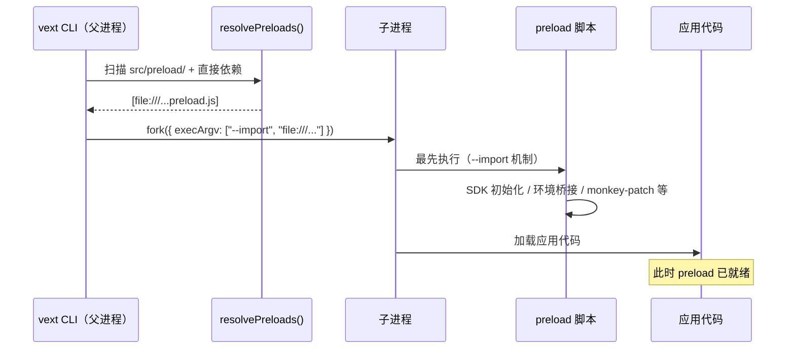

# 预加载（Preload）

VextJS 提供了 **预加载（Preload）** 机制，允许以下两类来源在 Node.js 模块加载之前执行脚本：

1. **依赖包声明**：npm 包在 `package.json` 中声明 `vext.preload`
2. **项目级目录**：应用项目中的规范目录 `src/preload/`

`vext start` / `vext dev` 会自动发现这些声明，并通过 `--import` 参数注入到子进程中。

## 为什么需要预加载？

某些工具（如 OpenTelemetry SDK）必须在应用代码加载**之前**完成初始化，才能正确 patch Node.js 内置模块（http、net、dns）和第三方库（MongoDB、pg、Redis 等）。

Node.js 的 `--import` 参数正是为此设计：它确保指定脚本在**任何**用户代码执行前运行。

手动添加 `--import` 需要修改启动脚本，增加了配置负担。VextJS 的 preload 机制将这一步**自动化**：

- 插件包只需在 `package.json` 中声明 `vext.preload`
- 应用项目只需创建 `src/preload/` 目录

CLI 会自动完成注入。

> 应用项目无需再为了 preload 去包装一个本地 npm 包。需要第一个 preload 源文件时再创建 `src/preload/`；脚手架不会创建空目录。

## 工作原理

```text
vext start / vext dev
  ↓
扫描规范的 src/preload/（或带 warning 的历史项目根 preload/ 回退）
  ↓
读取项目 package.json 的 dependencies + devDependencies
  ↓
遍历已安装依赖的 package.json，查找 "vext.preload" 字段
  ↓
选中的项目级 preload 目录与包级 preload 合并、去重并转换为 file:/// URL
  ↓
以 --import <url> 参数注入到子进程 execArgv
  ↓
子进程启动时，preload 脚本最先执行（早于所有应用代码）
```

### 时序图



## 声明 preload

### 方式 A：项目级 `src/preload/` 目录

在应用源码目录中创建：

```text
src/preload/
├── 01-bootstrap-port.ts
├── 02-bootstrap-verbose.mjs
└── 03-polyfill.js
```

首期规则：

| 规则           | 说明                                                  |
| -------------- | ----------------------------------------------------- |
| 目录位置       | 固定为规范目录 `src/preload/`                         |
| 扫描范围       | **非递归**，只扫描当前目录一级文件                    |
| 文件顺序       | 按文件名升序注入                                      |
| 项目级 vs 包级 | **项目级 preload 先执行**，包级 `vext.preload` 后执行 |
| 去重           | 按绝对路径去重                                        |

#### 历史根目录迁移

项目根 `preload/` 仅作为临时迁移回退受支持。它含有支持的 preload 源文件时，Vext 会输出指向 `src/preload/` 的 warning。不要同时在两个目录放置支持的 preload 文件：preload 可能初始化全局 instrumentation，Vext 会 fail-fast 而不会合并它们，避免重复执行。

#### 支持的文件类型

| 类型   | 处理方式                                  | 推荐度  |
| ------ | ----------------------------------------- | :-----: |
| `.mjs` | 直接注入                                  | ✅ 推荐 |
| `.js`  | 在 ESM 项目下直接注入                     | ✅ 可用 |
| `.ts`  | 启动前编译到 `.vext/preload/*.mjs` 再注入 | ✅ 可用 |
| `.mts` | 启动前编译到 `.vext/preload/*.mjs` 再注入 | ✅ 推荐 |

> 推荐优先使用 `.mjs` / `.mts`，语义最清晰。

#### TypeScript preload 的工作方式

如果项目级 `src/preload/` 目录中包含 `.ts` / `.mts` 文件，CLI 会在启动前使用 `esbuild` 将其编译到：

```text
.vext/preload/*.mjs
```

例如：

```text
src/preload/01-bootstrap-port.ts
→ .vext/preload/01-bootstrap-port.__compiled__.mjs
→ --import file:///.../.vext/preload/01-bootstrap-port.__compiled__.mjs
```

这样做的目的，是在不改造 `vext build` 主编译链的前提下，同时保证：

- `vext dev`
- `vext start`
- Cluster worker

三条链路的 preload 行为一致。

#### `vext dev` 下的行为

项目级 preload 属于**启动前执行逻辑**。因此当 `src/preload/` 里的文件发生新增 / 修改 / 删除时：

- `vext dev` 会监听该目录
- 并统一触发 **cold restart**

这能确保结果与手动重启一致，避免“preload 已改但开发服务器仍沿用旧注入结果”。

### 方式 B：依赖包 `vext.preload`

在 npm 包的 `package.json` 中添加 `vext.preload` 字段：

```json
{
  "name": "my-vext-plugin",
  "vext": {
    "preload": "./dist/instrumentation.js"
  }
}
```

#### 字段格式

| 格式   | 示例                             | 说明                     |
| ------ | -------------------------------- | ------------------------ |
| 字符串 | `"./dist/init.js"`               | 单个预加载脚本           |
| 数组   | `["./dist/a.js", "./dist/b.js"]` | 多个脚本，按数组顺序注入 |

路径相对于包根目录（`node_modules/<package>/`），由 CLI 自动解析为绝对路径。

#### 真实示例

`@devcodex/opentelemetry` 已内置此声明：

```json
{
  "name": "@devcodex/opentelemetry",
  "vext": {
    "preload": "./dist/instrumentation.js"
  }
}
```

安装后，`vext start` / `vext dev` 自动注入 `--import`，OpenTelemetry SDK 在应用启动前完成初始化，MongoDB / pg / Redis 等自动 patch 生效。

## 适用场景

| 场景                  | 说明                                                     |
| --------------------- | -------------------------------------------------------- |
| **OpenTelemetry SDK** | 必须在模块加载前初始化，才能 monkey-patch HTTP/DB 客户端 |
| **APM 工具**          | Datadog、New Relic 等 APM agent 同理                     |
| **全局 polyfill**     | 需要在所有代码执行前注入的全局补丁                       |
| **进程级配置桥接**    | 例如设置环境变量，让 bootstrap provider 在配置阶段读取   |

## preload 与 bootstrap config provider 的边界

`preload` 和 `src/config/bootstrap.ts` 都发生在应用完全启动前，但职责不同：

| 能力                             | preload                                           | bootstrap config provider           |
| -------------------------------- | ------------------------------------------------- | ----------------------------------- |
| 执行时机                         | Node.js 模块加载前（`--import`）                  | 配置 merge / validate / freeze 之前 |
| 主要职责                         | SDK 初始化、环境桥接、monkey patch、全局 polyfill | 返回结构化配置补丁                  |
| 是否参与配置优先级链             | ❌                                                | ✅                                  |
| 是否适合作为远程数据库配置主路径 | ❌                                                | ✅                                  |

推荐做法：

- **APM / OpenTelemetry / monkey patch** → 用 `preload`
- **启动前桥接环境变量给 bootstrap provider** → 也可以用 `preload`
- **远程配置中心 / 启动期数据库配置主链** → 用 `bootstrap config provider`
- 两者可以配合：preload 先准备 SDK、token cache 或环境变量，provider 再读取这些状态产出 patch

## 三种启动模式

| 模式                                  | preload 生效？ | 说明                          |
| ------------------------------------- | :------------: | ----------------------------- |
| `vext start` / `vext dev`             |       ✅       | CLI 自动发现并注入 `--import` |
| `node --import <path> dist/server.js` |       ✅       | 手动添加 `--import`，效果相同 |
| `node dist/server.js`（无 --import）  |       ❌       | preload 脚本不会执行          |

> 推荐使用 `vext start` / `vext dev`，享受自动注入的便利。

## Cluster 模式

在 Cluster 模式下，preload 脚本同样生效。CLI 通过 `cluster.setupPrimary({ execArgv })` 将 `--import` 参数传递给所有 Worker 进程：

```bash
VEXT_CLUSTER=1 vext start   # 每个 Worker 自动加载 preload 脚本
```

## 注意事项

### 安全行为

- **项目级目录为受控单目录**：`src/preload/` 是规范目录，并且只非递归扫描它。项目根 `preload/` 是带 warning 的兼容回退，不是第二个源目录
- **仅扫描直接依赖**：CLI 只读取项目 `package.json` 的 `dependencies` + `devDependencies`，不递归扫描子依赖
- **文件不存在时跳过**：`vext.preload` 指向的文件不存在时，CLI 输出 warning 并跳过，不阻断启动
- **解析失败时降级**：依赖包 `package.json` 解析失败时静默跳过
- **项目级 TS preload 编译失败时 fail-fast**：避免把明显不可执行的 TS preload 带进运行阶段
- **无 preload 声明时无影响**：没有项目级目录、也没有包级 preload 声明时，CLI 行为与之前完全一致

### 与手动 `--import` 共存

CLI 注入的 `--import` 与用户手动添加的 `--import` 不冲突。如果同一脚本被注入两次，SDK 内部通常有全局注册保护，不会重复初始化。

### 开发 preload 脚本的建议

- 脚本应快速执行，避免阻塞应用启动
- 如果是 `.js` / `.ts`，请确保项目采用 ESM 语义（`"type": "module"`）
- 错误应自行处理；若是 TS preload，语法编译错误会直接中断启动

### 部署边界

如果你使用的是**项目级 `src/preload/`**：

- `vext build` 会把 `src/preload/` 编译到 `dist/preload/`
- `.ts` / `.mts` / `.js` / `.mjs` 都会统一输出为可直接 `--import` 的 `.mjs` 文件
- 因此生产部署时，通常只需要一起携带：
  - 项目根 `package.json`
  - `dist/`（其中已包含 `dist/preload/`，如被使用）

`vext start` 会优先解析有源文件的 `src/preload/`；只有在它不可用时才把有源文件的历史项目根 `preload/` 作为带 warning 的回退，否则从已构建部署读取 `dist/preload/`。

## 编写自定义 preload

### 编写项目级 preload

```ts
// src/preload/01-bootstrap-port.ts
process.env.APP_BOOTSTRAP_PORT = "3011";
```

```js
// src/preload/02-sdk.mjs
try {
  const { init } = await import("../src/sdk.js");
  await init();
} catch (err) {
  console.warn("[app preload] init failed:", err.message);
}
```

### 编写包级 preload

如果你正在开发一个需要 preload 的 vext 插件包：

```typescript
// src/instrumentation.ts — preload 入口
try {
  console.log("[my-plugin] preload script executed");

  const { init } = await import("./sdk.js");
  await init();
} catch (err) {
  console.warn("[my-plugin] preload failed:", (err as Error).message);
}

export {};
```

在 `package.json` 中声明：

```json
{
  "name": "my-vext-plugin",
  "vext": {
    "preload": "./dist/instrumentation.js"
  }
}
```

构建后，任何使用 `vext start` / `vext dev` 的项目安装此包后，preload 脚本会自动执行。

## 下一步

- 查看 [OpenTelemetry 可观测性](/examples/opentelemetry) 了解 preload 的典型应用
- 了解 [插件](/guide/plugins) 系统的完整能力
- 探索 [Cluster 多进程](/guide/cluster) 模式下的 preload 行为
